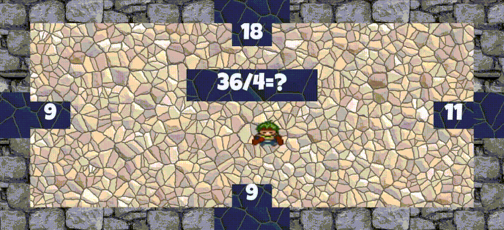

# Pulmalabyrintti

Simple arithmetic game. The player tries to calculate the result of the task shown in the middle of the screen. The tasks can be addition, subtraction, multiplication or division of two numbers. Options are shown on each side of the screen. The player can try each answer until the correct one is found. If the player gets the answer correct, the middle of the screen gets a green border and then the player is given a new task.

The tasks are autogenerated, so there is no upper limit to their number.

The player figure can be moved around with the arrow keys or w,a,s,d keys, which correspond to up, left, down and right. It is also possible to use the mouse cursor to select the answer. Touch screens can also be used. Even a [dance pad](https://en.wikipedia.org/wiki/Dance_pad) can be used :)

Build using [Javascript](http://www.w3schools.com/js/), [jQuery](https://jquery.com/) and [svg.js](http://svgjs.com/). Based on an [initial template](https://github.com/changty/js-boilerplate) by [changty](https://github.com/changty). Further details about the template in the [technical readme](TECHNICAL_README.md). Collaboration with [scatterb](https://github.com/scatterb)(css) and [Jadahoo](https://github.com/Jadahoo)(graphics).

The game can be played [online here](http://gellati.github.io/pulmalabyrintti)

Made for the ViLLE Edugame Hackathon 22-24.4.2016.

Small view of the game.